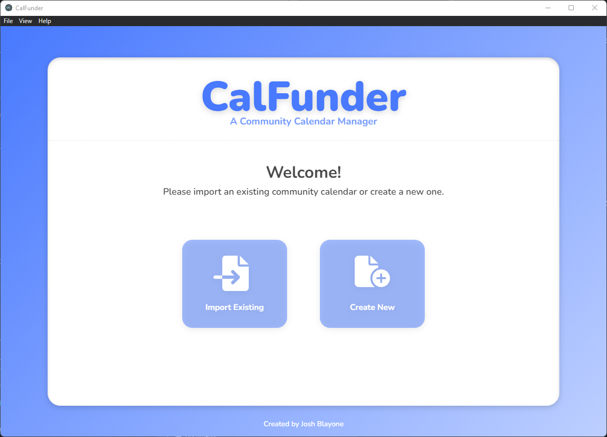
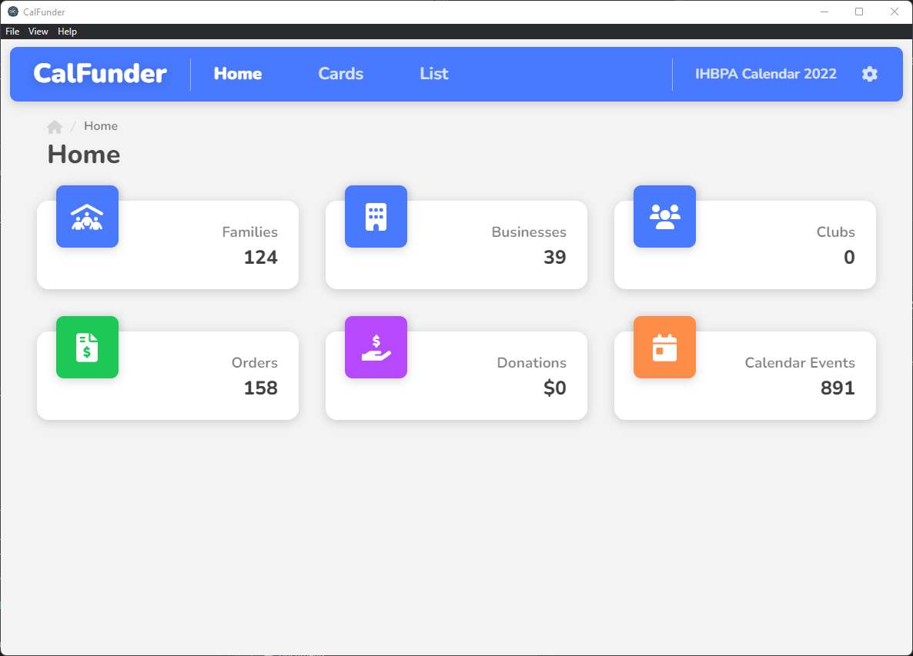
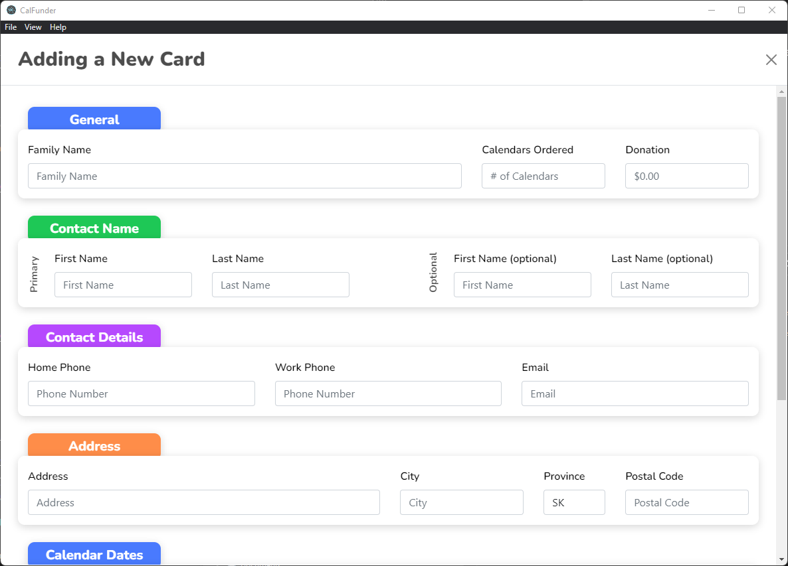

# **CalFunder**

<div style="margin: 10px; display:flex; flex-direction: row; flex-wrap: wrap; justify-content: space-around; height: 325px;">
  
</div>

<div style="margin: 10px; display:flex; flex-direction: row; flex-wrap: wrap; justify-content: space-around; height: 325px;">
  
</div>

<div align="center">

[![Build Status][github-actions-status]][github-actions-url]
[![Github Tag][github-tag-image]][github-tag-url]

</div>

---

<p>
CalFunder is a cross-platform application that makes it easy to create and manage a community calendar.
</p>

<br>

## Create Your Own Package

To package the app for the local platform:

```bash
git clone --branch main https://github.com/Rustizx/CommunityCalendarManager.git
cd CommunityCalendarManager
npm install
npm run package
```

## Starting Development

Clone the repo and install dependencies:

```bash
git clone --branch main https://github.com/Rustizx/CommunityCalendarManager.git
cd CommunityCalendarManager
npm install
```

## License

GPL-3.0 License © [Josh Blayone](https://github.com/Rustizx)

[github-actions-status]: https://github.com/Rustizx/CommunityCalendarManager/workflows/Test/badge.svg
[github-actions-url]: https://github.com/Rustizx/CommunityCalendarManager/actions
[github-tag-image]: https://img.shields.io/github/v/tag/Rustizx/CommunityCalendarManager.svg?label=version&sort=semver
[github-tag-url]: https://github.com/Rustizx/CommunityCalendarManager/releases
